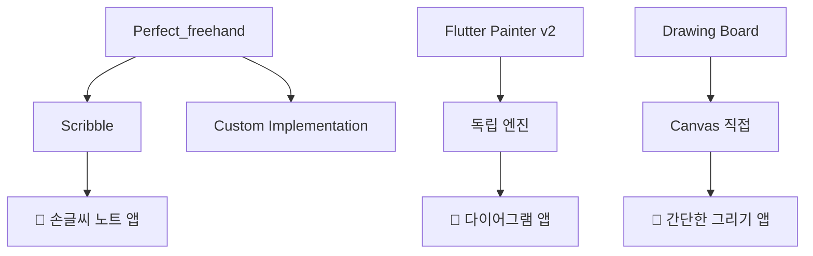

# Flutter Drawing Packages Comparison Report

## 📊 **종합 평가 요약**

| 패키지                    | 획 단위 삭제 | 올가미 툴 구현 | 전체 평점  | 추천도           |
| ------------------------- | ------------ | -------------- | ---------- | ---------------- |
| **Scribble**              | ✅ 완벽 지원 | 🟢 매우 적합   | ⭐⭐⭐⭐⭐ | 🏆 **강력 추천** |
| **Flutter Painter v2**    | ❌ 미지원    | 🟡 제한적      | ⭐⭐⭐     | 🤔 조건부 사용   |
| **Flutter Drawing Board** | ❌ 미지원    | 🔴 부적합      | ⭐⭐       | ❌ 비추천        |

---

## 🎯 **핵심 요구사항 분석**

### **1️⃣ 획 단위 지우개 기능**

> **손글씨 노트 앱의 가장 중요한 요구사항**

#### 🏆 **Scribble - 완벽 구현**

- ✅ 개별 스트로크를 독립적 객체로 관리
- ✅ `notifier.setEraser()` → 터치한 스트로크만 정확히 삭제
- ✅ Perfect_freehand 기반으로 자연스러운 스트로크 렌더링

#### ❌ **Flutter Painter v2 - 구조적 한계**

- ❌ 공식 문서: "erasing is just another layer"
- ❌ 브러시 방식 지우개 (픽셀 단위 제거)
- ❌ 지우개 모드 시 객체 잠금

#### ❌ **Flutter Drawing Board - 레이어 기반**

- ❌ Canvas에 직접 그리기 방식
- ❌ 투명한 브러시로 동작하는 지우개
- ❌ 스트로크 메타데이터 손실

---

## 🎯 **올가미 툴 구현 가능성**

### **🟢 Scribble - 최적 환경**

```dart
// 1. 개별 스트로크 접근
List<Drawable> allStrokes = notifier.currentSketch.drawables;

// 2. Point-in-polygon 알고리즘 적용
List<Drawable> selectedStrokes = allStrokes
  .where((stroke) => isStrokeInLasso(stroke.points, lassoArea))
  .toList();

// 3. 선택된 스트로크들 조작
selectedStrokes.forEach(notifier.removeDrawable);
```

**장점:**

- ✅ 각 스트로크의 모든 점에 접근 가능
- ✅ JSON 직렬화로 선택 상태 저장/복원
- ✅ 기존 API(`removeDrawable`, `addDrawable`)로 조작 용이

### **🟡 Flutter Painter v2 - 제한적 가능**

- ✅ 도형, 텍스트 객체는 선택 가능
- ❌ 자유 그리기 스트로크는 개별 관리 불가
- ❌ 지우개와 선택 기능 충돌

### **🔴 Flutter Drawing Board - 구현 불가**

- ❌ 레이어 기반으로 개별 객체 추적 불가
- ❌ 그리기 후 픽셀 데이터로만 존재
- ❌ 메타데이터 부족으로 역추적 어려움

---

## 🔍 **아키텍처 비교 분석**

### **Scribble - 객체 기반 구조**

```
ScribbleNotifier
├── Sketch
│   ├── List<Drawable> drawables
│   │   ├── Stroke (점들의 배열)
│   │   ├── 색상, 굵기, 시간 정보
│   │   └── JSON 직렬화 지원
│   └── 메타데이터
└── 상태 관리 (Undo/Redo)
```

### **Flutter Painter v2 - 하이브리드 구조**

```
PainterController
├── ObjectDrawables (도형, 텍스트)
├── FreeStyleDrawables (스트로크) - 개별 접근 제한
└── BackgroundDrawables (이미지, 배경)
```

### **Flutter Drawing Board - 레이어 구조**

```
DrawingController
├── Canvas Layer 1
├── Canvas Layer 2
└── Canvas Layer N (픽셀 데이터만)
```

---

## 📈 **성능 및 메모리 사용량**

| 측면              | Scribble            | Flutter Painter v2 | Drawing Board  |
| ----------------- | ------------------- | ------------------ | -------------- |
| **메모리 효율성** | 🟢 객체 기반 최적화 | 🟡 중간            | 🟠 레이어 누적 |
| **렌더링 성능**   | 🟢 Perfect_freehand | 🟢 네이티브 Canvas | 🟢 Canvas 직접 |
| **직렬화 속도**   | 🟢 JSON 최적화      | 🟡 부분 지원       | 🔴 이미지만    |
| **확장성**        | 🟢 뛰어남           | 🟡 제한적          | 🔴 어려움      |

---

## 💡 **Perfect_freehand 관계도**



**핵심 인사이트:**

- **Perfect_freehand**: 저수준 기하학적 계산 라이브러리
- **Scribble**: Perfect_freehand + 완전한 드로잉 시스템
- **다른 패키지들**: 독립적인 구현 방식

---

## 🎯 **최종 권장사항**

### **🏆 Scribble 패키지 선택 이유**

#### **1. 핵심 요구사항 완벽 충족**

- ✅ 획 단위 지우개 기능
- ✅ 올가미 툴 구현 최적 환경
- ✅ 개별 스트로크 완전 제어

#### **2. 기술적 우수성**

- ✅ Perfect_freehand 기반의 자연스러운 렌더링
- ✅ 효율적인 메모리 관리
- ✅ JSON 직렬화로 상태 관리 용이

#### **3. 확장성 및 유지보수성**

- ✅ 잘 설계된 API
- ✅ 활발한 커뮤니티 지원
- ✅ 검증된 안정성

### **📋 다음 단계 계획**

1. **Scribble 기반 올가미 툴 구현**
2. **Point-in-polygon 알고리즘 적용**
3. **선택된 스트로크 다중 조작 기능**
4. **고급 편집 도구 확장**

---

## 📚 **참고 자료**

### **패키지 링크**

- [Scribble](https://pub.dev/packages/scribble) - 추천 패키지
- [Perfect_freehand](https://pub.dev/packages/perfect_freehand) - 기반 라이브러리
- [Flutter Painter v2](https://pub.dev/packages/flutter_painter_v2) - 객체 편집용
- [Flutter Drawing Board](https://pub.dev/packages/flutter_drawing_board) - 간단한 그리기용

### **구현 예제**

- `lib/drawing_tests/scribble/` - Scribble 완전 구현
- `lib/drawing_tests/flutter_painter_v2/` - 고급 객체 편집 예제
- `lib/drawing_tests/drawing_board/` - 기본 그리기 구현

---

_이 보고서는 실제 구현과 테스트를 통해 작성되었으며, 손글씨 노트 앱 개발을 위한 기술적 의사결정 근거를 제공합니다._
